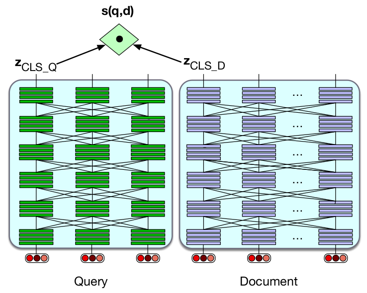

# DeepKIN

A deep learning toolkit for Kinyarwanda NLP.

## Getting started

This toolkit depends on a Morphological analyzer/generator for Kinyarwanda and related models.
In order to use the toolkit, you need to go through the following steps:
1. Download and install the morphological analyzer/generator
2. Get a free license for the morphological analyzer/generator
2. Clone and install DeepKIN toolkit and its dependencies
3. Run experimental code

## Downloading and installing Kinyarwanda morphological analyzer/generator

The current release (version 0.1.0) of the morphological analyzer is only compatible with Linux x84_64 platform.
In order to run the morphological analyzer/generator, the system must meet the following minimum requirements:
- Operating system: Linux x86_64 (amd64), we have tested it with Ubuntu 64-bit, 18.04, 20.04 and 22.04 versions
- Drive space: 45 GB, (64 GB recommended)
- System memory (RAM): 40 GB (64 GB recommended)

The morphological analyzer is available for download from the following Google Drive link:
https://drive.google.com/file/d/1Kt9YXhLw_UVMCefcRGworyHUdh-tyQRj/view
With the link, you can download it directly to your machine.
In order to download it from a terminal (i.e. on a remote server), you need to use an OAuth token as in the following steps:
1. Go to OAuth 2.0 Playground https://developers.google.com/oauthplayground/
2. In the Select the Scope box, paste https://www.googleapis.com/auth/drive.readonly
3. Click Authorize APIs and then Exchange authorization code for tokens
4. Copy the Access token
5. Run the following command in terminal, where ACCESS_TOKEN is the access token copied above:
```
curl -H "Authorization: Bearer ACCESS_TOKEN" https://www.googleapis.com/drive/v3/files/1Kt9YXhLw_UVMCefcRGworyHUdh-tyQRj?alt=media -o KINLP.tar.gz
```

The morphological analyzer/generator package installation directory needs to be refered as `KINLP_HOME` environmental variable or be installed in `/opt/KINLP` path as follow:
```
gunzip -c KINLP.tar.gz | tar x
rm KINLP.tar.gz
sudo ln -s </path/to/downloaded/KINLP> /opt/KINLP
```

You can configure the following environmental variables at the shell startup for the morphological analyze to be available; e.g:
```
UBUNTU_VERSION=$(lsb_release -r --short)
export KINLP_HOME=/opt/KINLP
export PATH=$PATH:$KINLP_HOME:$KINLP_HOME/bin/$UBUNTU_VERSION
export LD_LIBRARY_PATH=$LD_LIBRARY_PATH:$KINLP_HOME/lib/$UBUNTU_VERSION
```

Before using the morphological analyzer/generator, the following packages are needed on a Linux: `gcc g++ make cmake libomp-dev libgsl-dev gsl-bin libgsl-dbg python3-pybind11 pybind11-dev unicode libicu-dev`.
You can install them on Ubuntu Linux as follows:
```
sudo apt update
sudo apt install -y nano gcc g++ make cmake ninja-build libomp-dev libgsl-dev gsl-bin libgsl-dbg python3-pybind11 pybind11-dev unicode libicu-dev
```
This has only been tested on Ubuntu versions 18.04, 20.04 and 22.04.

Currently, the morphological analyzer/generator can be run in three different use-cases:
#### 1. To check the license validity:
```
bash $KINLP_HOME/morphokin.sh license </path/to/LICENSE_FILE.dat>
```
#### 2. Sentence analysis via interactive shell:
```
bash $KINLP_HOME/morphokin.sh snt </path/to/LICENSE_FILE.dat>
```
To exit the snt shell, enter either one of `exit, EXIT, e, E, quit, QUIT, q, Q` commands on the shell.

#### 3. To run morphological analysis and synthesis server on a unix socket; e.g. for Python API calls:
```
nohup bash $KINLP_HOME/morphokin.sh rms </path/to/LICENSE_FILE.dat> &>> rms.log &
```

## Getting the free license for the morphological analyzer

The free license is only allowed for academic and non-commercial use of the morphological analyzer/generator. 
Refer to the [Terms and Conditions](https://docs.google.com/document/d/17elFQbP4lR8uSufsU1NymObH_t2z0dy7sq78fbIMU7M/view) for the morphological analyzer/generator.

To request a free license, fill in the registration form available at::
https://morphokin.kinlp.com/license/request
The form requests basic information about the user and their organization.
Once submitted, you will be required to verify the email address by clicking on the confirmation link sent to your email address.

Once approved, a free license file will be sent to your email address.
Use the license with morphological analyzer as suggested in the previous section, where `</path/to/LICENSE_FILE.dat>` is the path to the license file on your system.

## Cloning and installing DeepKIN toolkit and its dependencies

**DeepKIN** toolkit implements deep learning models for Kinyarwanda NLP tasks such as text classification, language modeling, named entity recognition and others. The toolkit depends on the Kinyarwanda morphological analyzer/generator at its core.
It also depends on PyTorch and other python packages.
We recommend to use [Anaconda](https://www.anaconda.com/download) distribution with virtual environment as we have tested with it.
You will also need a CUDA-enabled GPU with at least 12 GB or GPU RAM. Nvidia GPUs with Tensor Cores are most recommended.

Go through the following commands for the installation of the toolkit and itse dependencies:
```
source </path/to/anaconda>/etc/profile.d/conda.sh

conda create -n deepkin

conda activate deepkin

conda install -c "nvidia/label/cuda-11.8.0" cuda-toolkit

conda install pytorch torchvision torchaudio pytorch-cuda=11.8 -c pytorch -c nvidia

pip install Cython
pip install distro
pip install progressbar2
pip install seqeval
pip install youtokentome
pip install tensorboardX
pip install sacremoses
pip install fastBPE
pip install packaging
pip install mutagen
pip install torchmetrics
pip install pandas


git clone https://github.com/pytorch/fairseq
cd fairseq
pip install -e ./


git clone https://github.com/NVIDIA/apex
cd apex
# if pip >= 23.1 (ref: https://pip.pypa.io/en/stable/news/#v23-1) which supports multiple `--config-settings` with the same key... 
pip install -v --disable-pip-version-check --no-cache-dir --no-build-isolation --config-settings "--build-option=--cpp_ext" --config-settings "--build-option=--cuda_ext" ./
# otherwise
pip install -v --disable-pip-version-check --no-cache-dir --no-build-isolation --global-option="--cpp_ext" --global-option="--cuda_ext" ./


git clone https://github.com/anzeyimana/DeepKIN.git

cd DeepKIN/

pip install -e ./

```
**Apex installation** might take more than 10 minutes.
The goal of installing the specified cuda-toolkit and pytorch is to have the same nvcc version used for compiling pytorch binaries and apex package to be compiled. So, having a different cuda-toolkit version is OK as long as the nvcc version is the same as the one used to compile pytorch.

You may need to provide link a forward-compatible C++ standard library; e.g:
```shell
unlink </path/to/anaconda>/envs/deepkin/lib/libstdc++.so.6
ln -s /usr/lib/x86_64-linux-gnu/libstdc++.so.6 </path/to/anaconda>/envs/deepkin/lib/libstdc++.so.6

```

Finally, you can run the following experimental scripts for various tasks:
First, you will need to run the morphological analyzer server in the background:
```
nohup bash $KINLP_HOME/morphokin.sh rms </path/to/LICENSE_FILE.dat> &>> rms.log &
```
#### 1. Fine-tune KinyaBERT for named entity recognition (NER)
```
bash ./scripts/bert_gpt/train_ner.sh
```
#### 2. Fine-tune and benchmark KinyaBERT on natural language inference tasks (e.g. Text Classification)
We use a Google-translated version of the [GLUE benchmark](https://gluebenchmark.com/) tasks (MRPC, RTE, STS-B, SST-2, QNLI) as well as [Tweet Sentiment Analysis](https://afrisenti-semeval.github.io/)
```
bash ./scripts/bert_gpt/nli_benchmark.sh
```
#### 3. Run KinyaBERT on a masked language model (MLM) task:
```
bash ./scripts/bert_gpt/test_mlm.sh
```
#### 4. Run GPT models' inference for text completion:
```
python3 scripts/bert_gpt/char_gpt_text_completion.py --input="Rwamagana: Bagiye guhugura abangavu bavuye mu ishuri" --max-output-length=100

python3 scripts/bert_gpt/syllabe_gpt_text_completion.py --input="Rwamagana: Bagiye guhugura abangavu bavuye mu ishuri" --max-output-length=90

python3 scripts/bert_gpt/kinya_gpt_text_completion.py --input="Rwamagana: Bagiye guhugura abangavu bavuye mu ishuri" --max-output-length=30
```
#### 5. Test named entity recognition (NER) inference:
```
python3 scripts/bert_gpt/ner_test.py --input="Rwamagana: Bagiye guhugura abangavu bavuye mu ishuri"
```
#### 6. [OPTIONAL] Perform/test data pre-processing (parsing by the morphological analyzer):
```
bash ./scripts/data/benchmark_data_process.sh
```
Note that the above scripts are not tuned to the best hyper-parameter setup. The goal is to be able to run the models on your platform.

#### 7. Training and evaluating KinyaBERT model on Semantic Textual Relatedness from SemEval 2024 Task 1:
First download the data from https://github.com/semantic-textual-relatedness/Semantic_Relatedness_SemEval2024,
Then perform training and evaluation using scripts inside `DeepKIN/scripts/classification_regression`
```
cd DeepKIN/scripts/classification_regression

sh train.sh

sh eval.sh
```
Note that to get high performance, one will need to adjust hyper-parameters and have some data augmentation.

#### 8. Using KinyaBERT model for a question answering (QA) chatbot:
The code needed for adapting KinyaBERT to question answering/chatbot application can be found in `DeepKIN/scripts/KinyaBERT_IR_QA`
The steps needed are:
1. Prepare a question-answering dataset in JSON format, similar to `scripts/KinyaBERT_IR_QA/qa_data.json`
2. Prepare a fine-tuning dataset that includes both the target QA data and the QNLI corpus to learn high quality embeddings for question answering
    - Script: `python scripts/KinyaBERT_IR_QA/prepare_qa_corpus.py`
3. Run the fine-tuning step (Post-MLM) to learn target embeddings
    - Script: `sh scripts/KinyaBERT_IR_QA/post_mlm.sh`
4. Run a question answering chatbot evaluation using your dataset
    - Script: `scripts/KinyaBERT_IR_QA/chatbot_app.sh`

The idea is to find an answer whose question patterns has the highest average cosine similarity (in embedding space) to the question asnked by the user.
This is introduced in Section 14.2 of "Speech and Language Processing (3rd ed. draft)" by Dan Jurafsky and James H. Martin.


#### 9. On-device automatic speech recognition (ASR) using a state-space model (i.e. Mamba architecture):
We developed a streaming speech recognition model that can be deployed on light-weight architectures such as smartphones without GPU.

The model is based on [Mamba state-space model architecture](https://arxiv.org/abs/2312.00752) and is implemented in Pytorch.

A pre-trained model is available for download from [https://drive.google.com/file/d/1eNvgPvYWITRKjWM4bH9sOXfDKfFtxqLU/view?usp=sharing](https://drive.google.com/file/d/1eNvgPvYWITRKjWM4bH9sOXfDKfFtxqLU/view?usp=sharing)

The model can be exported into a compiled TorchScript Lite model deployable on smartphones:
```shell
python scripts/mamba_mobile_asr/save_mamba_asr_model_for_mobile.py
```

An Android app that runs this model is available at [https://github.com/anzeyimana/KinyaEmformerRNNT/tree/main/Android/PyTorchStreamingASR](https://github.com/anzeyimana/KinyaEmformerRNNT/tree/main/Android/PyTorchStreamingASR)

A compiled demo APK File is available for download at [https://drive.google.com/file/d/1lChxbEi2dEM3gUWpJH3fSqMCG5NGTdxx/view?usp=sharing](https://drive.google.com/file/d/1lChxbEi2dEM3gUWpJH3fSqMCG5NGTdxx/view?usp=sharing)

## Citation

If you use this toolkit in your work, please cite us as:

```
@inproceedings{nzeyimana-2020-morphological,
    title = "Morphological disambiguation from stemming data",
    author = "Nzeyimana, Antoine",
    booktitle = "Proceedings of the 28th International Conference on Computational Linguistics",
    month = dec,
    year = "2020",
    address = "Barcelona, Spain (Online)",
    publisher = "International Committee on Computational Linguistics",
    url = "https://aclanthology.org/2020.coling-main.409",
    doi = "10.18653/v1/2020.coling-main.409",
    pages = "4649--4660",
}

@inproceedings{nzeyimana-niyongabo-rubungo-2022-kinyabert,
    title = "{K}inya{BERT}: a Morphology-aware {K}inyarwanda Language Model",
    author = "Nzeyimana, Antoine  and
      Niyongabo Rubungo, Andre",
    booktitle = "Proceedings of the 60th Annual Meeting of the Association for Computational Linguistics (Volume 1: Long Papers)",
    month = may,
    year = "2022",
    address = "Dublin, Ireland",
    publisher = "Association for Computational Linguistics",
    url = "https://aclanthology.org/2022.acl-long.367",
    doi = "10.18653/v1/2022.acl-long.367",
    pages = "5347--5363",
}

@inproceedings{nzeyimana-2023-kinlp,
    title = "{KINLP} at {S}em{E}val-2023 Task 12: {K}inyarwanda Tweet Sentiment Analysis",
    author = "Nzeyimana, Antoine",
    booktitle = "Proceedings of the 17th International Workshop on Semantic Evaluation (SemEval-2023)",
    month = jul,
    year = "2023",
    address = "Toronto, Canada",
    publisher = "Association for Computational Linguistics",
    url = "https://aclanthology.org/2023.semeval-1.98",
    doi = "10.18653/v1/2023.semeval-1.98",
    pages = "718--723",
}

```

